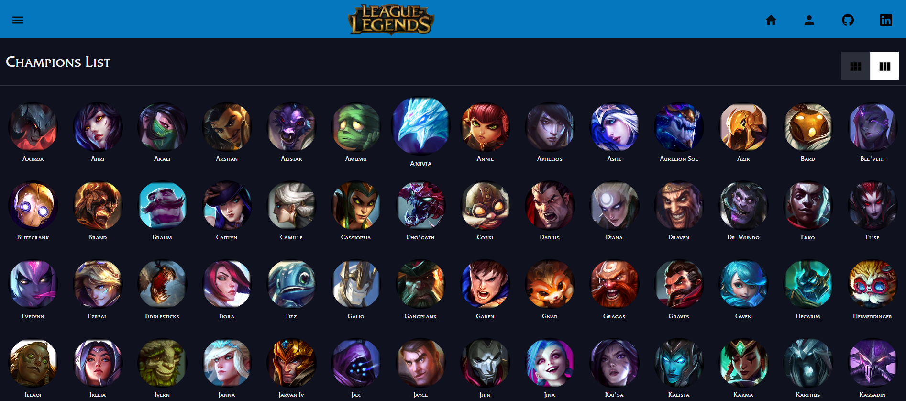

<p align="center">
  
</p>

<p align="center">
  <a href="http://commitizen.github.io/cz-cli/">
    
  </a>
</p>

# League of Legends - Angular
[https://edgarbenitez92.github.io/LeagueofLegends/](https://edgarbenitez92.github.io/LeagueofLegends/)

The Champions of the Summoner Rift built in Angular as a learning project.

## ¿Do you like the summoner rift?

You will see all champions in the last version game - League of Legends.

You can click a champion for seeing his details like a:

- **Abilities**
- **History**
- **Type**

and more...

## Development environment

### Minimum requirements

- [Nodejs (LTS)](https://nodejs.org/es/).
- [Angular](https://angular.io/).

Run in the root of the project:

```sh
$ npm install
$ ng serve
```

and enjoy it!!!

## References

### Development resources

* [NPM](https://docs.npmjs.com/): NPM is the world's largest software registry.
* [Angular](https://angular.io/): One framework.
* [Angular Folder Structure](https://angular-folder-structure.readthedocs.io/en/latest/): Create a skeleton structure which is flexible for projects big or small.
* [Google Font](https://fonts.google.com/): The web's most popular icon set and toolkit.
* [Angular Material](https://material.angular.io/): A modern, Material Design components for Angular.
* [Bootstrap](https://getbootstrap.com/): Powerful, extensible, and feature-packed frontend toolkit.
* [Data Dragon - Riot Games](https://developer.riotgames.com/docs/lol): It is designed to help you begin developing your own tools and products for the League of Legends player community.
* [League of Legends Font](https://thefontsmagazine.com/font/league-of-legends-font/): League of Legends Font is a logo font that we have seen in the game title. League of Legends is a multiplayer online video game developed and published by Riot Games for the first time in October 2009.
* [Ngx Spinner](https://www.npmjs.com/package/ngx-spinner): An animated loading spinner for Angular 4+ versions that is intended to inform the user that an operation is in progress.
* [Swiper](https://swiperjs.com/angular):  is the free and most modern mobile touch slider with hardware accelerated transitions and amazing native behavior.
* [Husky - Git Hooks](https://typicode.github.io/husky/#/): Husky improves your commits and more 🐶 _woof_!
- [Commitizen](https://github.com/commitizen/cz-cli): The commitizen command line utility.